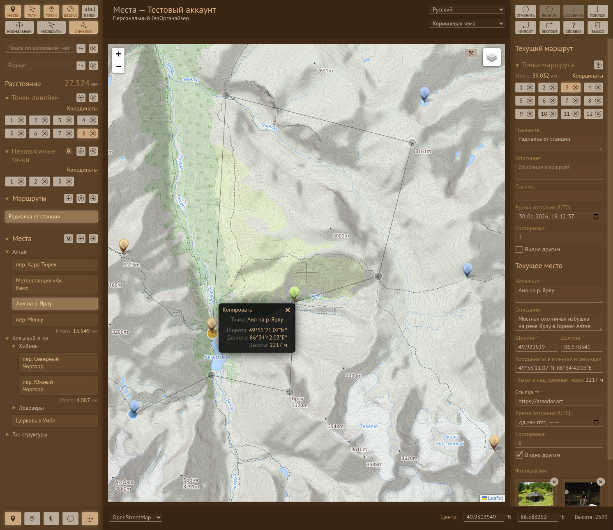
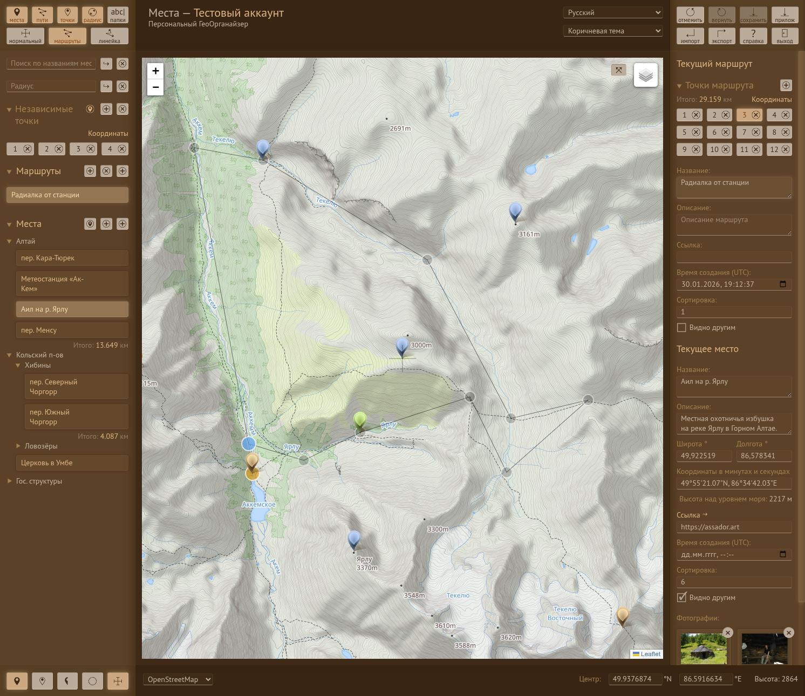

# The Places (Geo-Organizer)
**v6.3.6 beta** | [Русская версия](README.ru.md) | [Service](https://places.scrofa-tridens.ru/) | [Habr](https://habr.com/ru/articles/1009226/) | [User manual](MANUAL.md) | [Mail](mailto:places@scrofa-tridens.ru) | [Donate](https://boosty.to/assador/donate) | [Open Collective](https://opencollective.com/places)

Not just another map-based note app.  
The Places is a structured personal GIS designed for long-term, consistent management of geographic data.

## Core Idea

Everything is built on **atomic Points**.  
Points are reusable and can be referenced by higher-level entities such as:

- Places
- Routes
- (and future spatial structures)

This creates a **normalized spatial model** instead of fragmented, duplicated data.

## Why it matters

Most map apps store data like this: `marker → text`.

The Places treats your data as a system:

- reusable coordinates
- relational structure
- consistent spatial references

This makes the data scalable, composable, and future-proof.



## Sync Model

The Places uses a **deterministic batch-based synchronization system**:

- entities are tracked as `added / updated / deleted`
- updates are sent as structured packages
- backend processes them predictably

This approach:

- simplifies state management
- avoids hidden mutations
- prepares the system for **offline-first workflows**



## Tech Stack

- Frontend: Vue.js + Pinia
- Backend: PHP + MariaDB / MySQL
- Maps: OpenStreetMap, Yandex.Maps

## Roadmap

- Seamless real-world data capture on mobile (GPS, photos, instant place creation)
- PostgreSQL + PostGIS (advanced spatial queries)
- improved offline support
- data import/export
- API & integrations

## Philosophy

The Places is built as a **privacy-first alternative** to proprietary map platforms.

You own your data.  
You control your infrastructure.

## Status

The Places is built as a **privacy-first alternative** to proprietary map platforms.

## Installation and Deployment

1.  **Clone:** `git clone https://github.com/assador/places.git`
2.  **Database:** Create a MariaDB/MySQL database and import the schema from `/mezzanine/db_places.sql`.
3.  **Configuration:** Edit `/src/shared/constants.js` and `/backend/config.php`.
4.  **Permissions:** Ensure `/dist/uploads/images/` subdirectories (big, small, and their orphaned counterparts) are writable.
5.  **Cron:** Set up a cron job for `/backend/dist/cron.php` to clean up orphaned images and points.
6.  **Build:**
    ```bash
    npm install
    npm run build
    ```
7.  **Server:** Point your web server root to the `/dist` directory.
