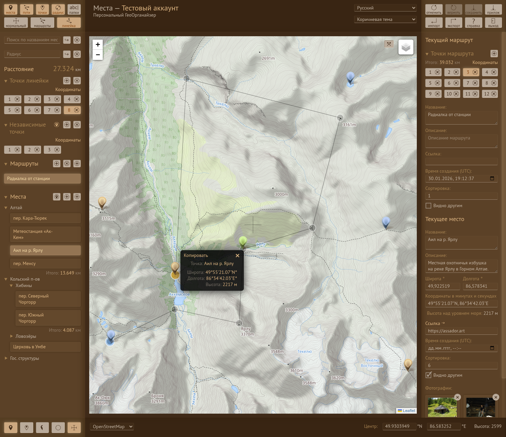

# Места (ГеоОрганайзер)
**v6.3.4 alpha** | [English version](README.md) | [Руководство пользователя](MANUAL.ru.md)

Персональный сервис для управления геометками, маршрутами и фотоальбомами.  
**Демо:** [places.scrofa-tridens.ru](https://places.scrofa-tridens.ru)

## Описание

«**Места**» — это функциональное SPA-приложение для структурирования личных географических данных, персональная ГИС-платформа. Сервис позволяет создавать иерархическую структуру папок, строить сложные маршруты и привязывать к локациям фотоальбомы. Проект ориентирован на удобство работы с данными и высокую скорость интерфейса и сочетает в себе гибкость древовидной иерархии и строгость реляционной модели данных.




## Основные возможности

- **Иерархическая структура:** Организация папок и локаций с неограниченной вложенностью.
- **Продвинутый Drag-and-Drop:** Интуитивная сортировка всех сущностей (папок, точек, маршрутов, фото) с логикой умной вставки.
- **Навигация и одометрия:** Динамический расчет протяженности маршрутов, учитывающий перегоны между группами точек.
- **Управление фото:** Полноценные фотоальбомы для локаций, маршрутов и отдельных точек с возможностью сортировки контента.
- **Импорт/Экспорт:** Поддержка форматов GPX и JSON для синхронизации с другими системами.
- **Мгновенный поиск:** Фильтрация всей базы данных по названиям и описаниям.

## Технологический стек

- **Frontend:** Vue 3 (Composition API), TypeScript (Strict Mode), Pinia, Axios.
- **Backend:** PHP 8. Высокая производительность БД достигается за счет использования **бинарных UUID (binary(16))** для первичных и внешних ключей, что оптимизирует индексацию и поиск.
- **Maps:** Гибридное использование API OpenStreetMap и Яндекс.Карт.
- **Data Flow:** Модульная архитектура с выносом бизнес-логики в `shared` утилиты, что делает основной код компонентов лаконичным и поддерживаемым.

## Техническое резюме

### Архитектурные преимущества и концепции

#### 1\. Атомарная модель данных (The “Point” Concept)

В основе системы лежит принцип разделения геометрии и метаданных.

- **Сущность Point:** Является базовым «атомом» с координатами (3D: lat, lon, alt).
- **Сущность Place/Route:** Выступают в роли информационных оболочек, ссылающихся на `Point`.
    
    Такой подход (нормализация уровня профессиональных ГИС) позволяет переиспользовать одну и ту же физическую точку в разных контекстах: она может одновременно быть самостоятельным «Местом», промежуточной точкой в нескольких «Маршрутах» и частью фотоальбома, исключая дублирование данных.

#### 2\. Масштабируемая иерархия

В отличие от большинства картографических сервисов с плоской структурой слоев, «Места» реализуют полноценное дерево данных.

- **Папки (Folders):** Поддерживают неограниченную вложенность и содержат логику сортировки для всех дочерних элементов.
- **Связность:** Все сущности (Места, Маршруты) интегрированы в общую иерархию, что позволяет пользователю выстраивать сложную персональную базу знаний.

#### 3\. Высокопроизводительный Batch-процессинг (Dirty Tracking)

Система управления состоянием на базе **Pinia** реализует механизм «грязных флагов» (`added`, `updated`, `deleted`). Это позволяет:

- Накапливать изменения локально в рамках сессии.
- Выполнять пакетную синхронизацию с сервером по требованию (Batch Save).
- Обеспечивать работу системы мгновенных снимков (Snapshots) для защиты от потери данных.

#### 4\. Продвинутый Drag-and-Drop интерфейс

Реализована интуитивная система реорганизации данных. Техническая особенность заключается в использовании **CSS-зон позиционирования** (`area_top`/`area_bottom`), что переносит вычислительную нагрузку по определению точки вставки с JavaScript на браузерный рендеринг. Это обеспечивает идеальную плавность (60 FPS) даже в глубоко вложенных списках.

#### 5\. Интеллектуальная одометрия

Маршруты поддерживают динамический расчет дистанции, который учитывает не только длину пути, но и специфику логических перелетов между группами точек, обеспечивая точные данные о протяженности сложных экспедиций.

## Установка и развертывание

1.  **Клонирование:** `git clone ...`
2.  **База данных:** Создайте БД и импортируйте дамп из `/mezzanine/db_places.sql`.
3.  **Настройка:** Отредактируйте параметры в `/src/shared/constants.js` и `/backend/config.php`.
4.  **Права доступа:** Убедитесь, что директории в `/dist/uploads/images/` доступны для записи.
5.  **Cron:** Настройте запуск `/backend/dist/cron.php` по расписанию для очистки временных данных.
6.  **Сборка:**
    
    ```bash
    npm install
    npm run build
    ```

7.  **Сервер:** Настройте веб-сервер, указав `/dist` в качестве корневой директории.
